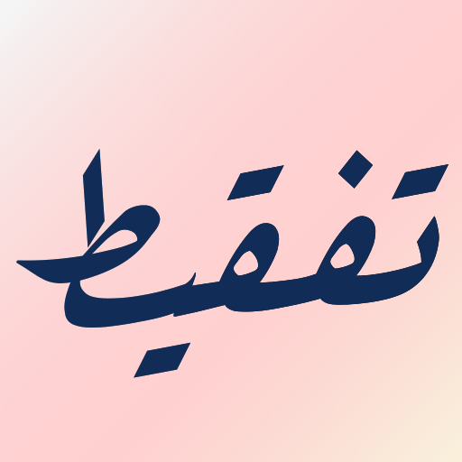

# NumberToWordConverter | تفقيط الارقام

an app for converting number to word in Arabic and English

# 📱 ScreenShots

 

# Features

* support change language form settings.
* support dynamic coloring for both UI and launcher Icon.
* support dark mode.
* share and copy both arabic and english sentence

### License

You may copy, distribute and modify the software as long as you track changes/dates in source files.
Any modifications
to or software including (via compiler) GPL-licensed code must also be made available under the GPL
along with build &
install instructions.